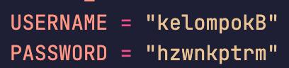
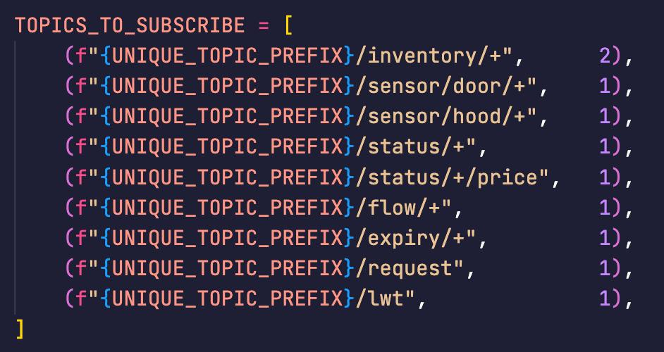
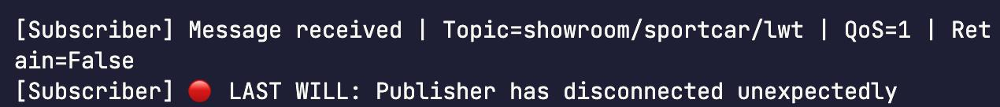

# **Dokumentasi MQTT untuk Showroom Mobil Sport dengan Python**

## Kelompok B

| Nama                     | NRP        |
| ------------------------ | ---------- |
| Hazwan Adhikara Nasution | 5027231017 |
| Rafael Gunawan           | 5027231019 |
| Rama Owarianto           | 5027231049 |

## Deskripsi Project

> Implementasi berbagai fitur MQTT dan MQTT S untuk sebuah aplikasi showroom mobil sport. Fitur yang di‐cover meliputi koneksi MQTT S, autentikasi, QoS 0/1/2, pesan retained, Last Will & Testament (LWT), Message Expiry (broker‐level dan application‐level), Request–Response (MQTT 5.0), Flow Control (rate limiting), serta mekanisme Ping/Pong untuk keep‐alive.

## Struktur File

- **`publisher.py`** : Skrip yang berfungsi sebagai “publisher” — mengirim data inventaris, status, sensor, price update, LWT, expiry, request–response, flow control.

- **`subscriber.py`** : Skrip yang berfungsi sebagai “subscriber” — mendengarkan berbagai topik, mem‐proses pesan, mengirim balasan untuk request–response, dan menampilkan LWT atau expiry.

- **test/** :

  - **`request_response.py`** : Menguji fitur Request–Response (MQTT 5.0).
  - **`expiry.py`** : Menguji Message Expiry (MQTT 5.0 broker‐level + application‐level).
  - **`flow_control.py`** : Menguji Flow Control (rate limit).

## How to run it?

1. Install Dependensi

```bash
pip install paho-mqtt
```

2. Jalankan Subscriber

```bash
python3 subscriber.py
```

> Subscriber sekarang “listening” ke semua topik yang di‐subscribe (inventory, sensor, status, price, expiry, request, flow, lwt).

3. Jalankan Publisher

```bash
python3 publisher.py
```

> Melakukan beberapa contoh publish (inventory, status, sensor, price, expiry, request, flow), lalu disconnect normal.

4. Authentication
> Menggunakan username_pw_set(USERNAME, PASSWORD) jika broker butuh autentikasi. Jika broker publik (misal HiveMQ) tidak memerlukan, field tersebut bisa dikosongkan atau di‐comment.


5. QoS 0, 1, 2
> Semua fungsi publish (publish_inventory_update, publish_sensor_door, dll.) menerima parameter qos. Di subscriber.py disebutkan pada topik:
```
1. QoS 2 untuk inventaris (paling andal, tanpa duplikat),
2. QoS 1 untuk sensor, status, price update, request–response, expiry, flow, LWT.
3. (QoS 0 juga bisa digunakan di fungsi, mis. publish_price_change(..., qos=0) bila diinginkan).
```


6. Retained Messages
Subscriber baru yang kemudian subscribe ke topik tersebut langsung menerima pesan terakhir yang di‐retained.


7. Uji LWT (Last Will)

> Setelah `publisher.py` sedang berjalan, force‐kill (misal `kill -9 PID`) sehingga publisher tidak melakukan disconnect clean. Subscriber akan mencetak LWT.



8. Jalankan Skrip Pengujian

- Request–Response:

```
python3 test_request_response.py
```

- Expiry:

```
python3 test_expiry.py
```

- Flow Control:

```
python3 test_flow_control.py
```

9. Flow Control (Rate Limiting)
> Membatasi kecepatan publish supaya broker dan subscriber tidak kewalahan.
```
test_flow_control.py menguji tiga kasus:
1. 10 pesan berturut‐turut → throughput ~5 msg/s.
2. 5 pesan dengan delay 0.01 s → throughput mendekati 5 msg/s.
3. 5 pesan dari thread berbeda → antrian tetap mem‐publish hanya 5 msg/s meski threads “sent” secara bersamaan.
```


10. Ping–Pong (Keep-Alive)
> Disini kita tidak mencode manual PING/PONG, karena library Paho MQTT yang menangani secara built‐in. Paho MQTT otomatis kirim PINGREQ/PINGRESP untuk menjaga koneksi tetap hidup.
```
client.connect(BROKER_HOST, BROKER_PORT, keepalive=KEEPALIVE)
```